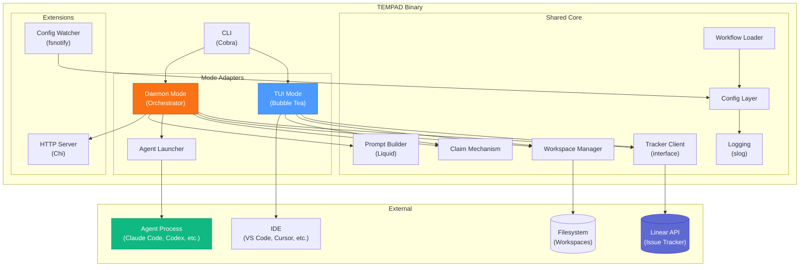
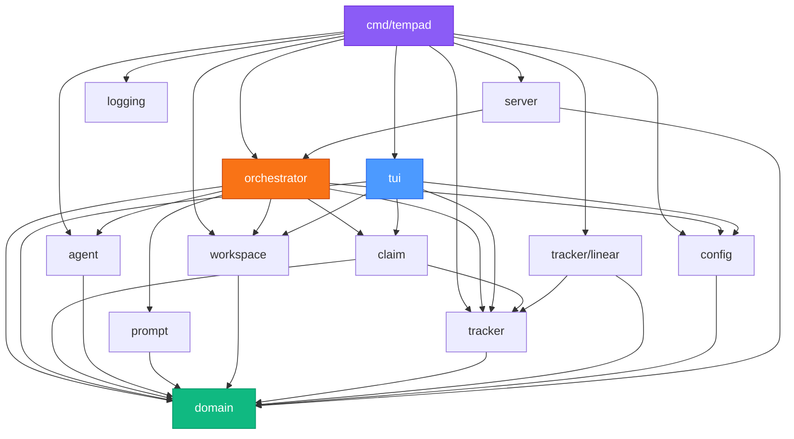
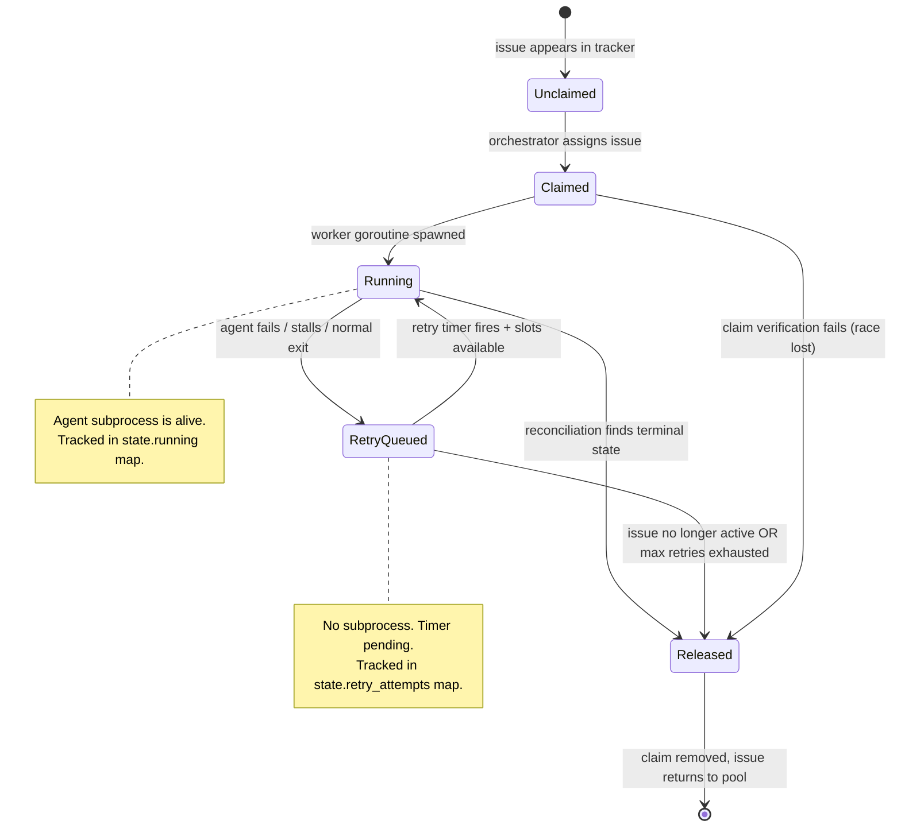
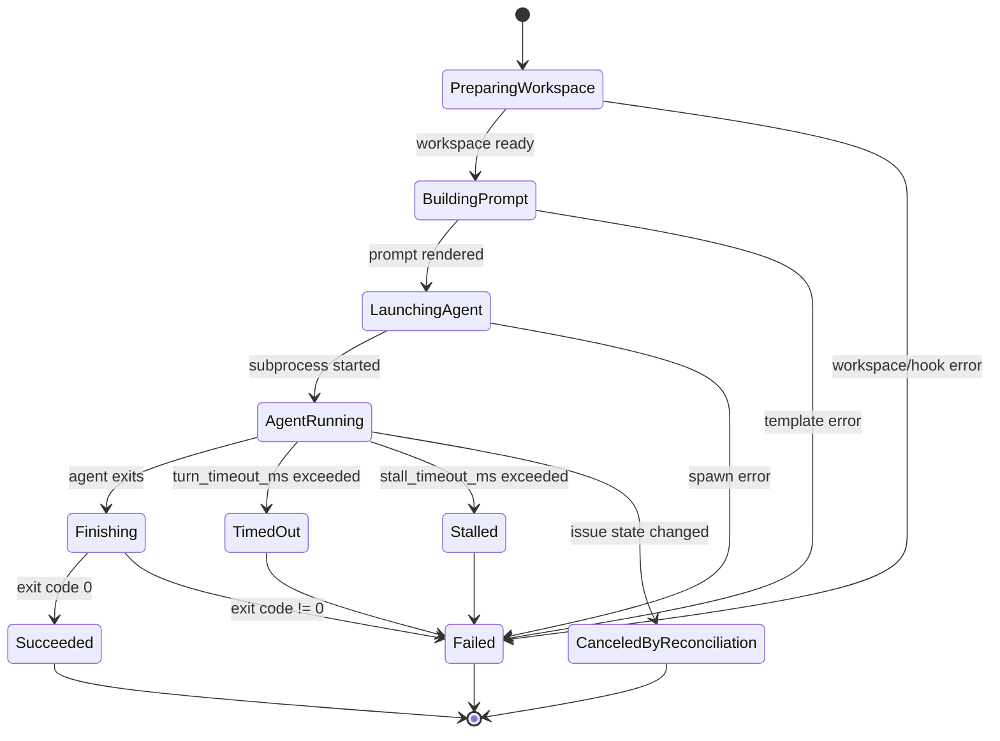
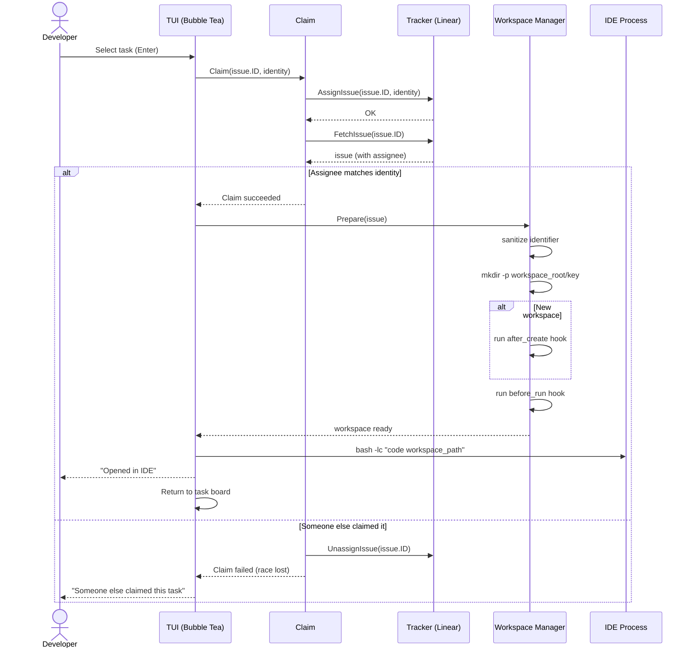
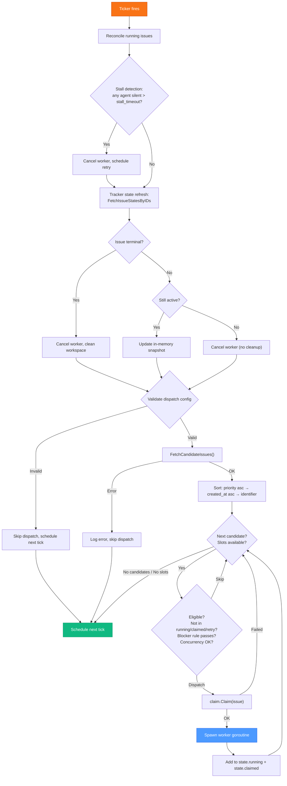
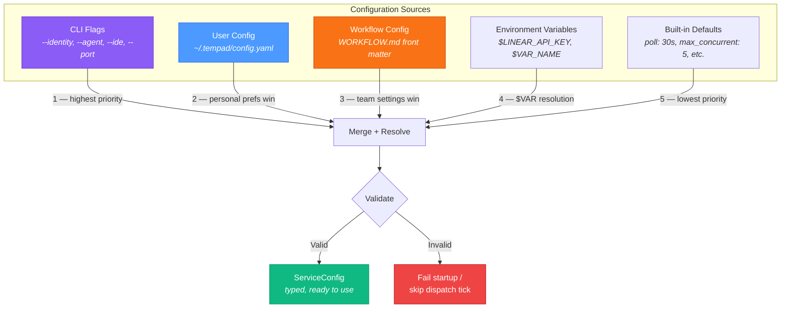
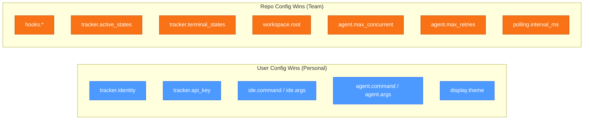
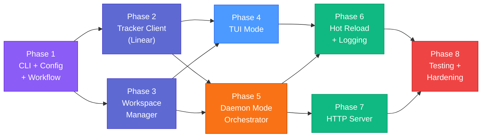

# TEMPAD Go Architecture

| | |
| --- | --- |
| **Version** | 1.0.0 |
| **Module** | `github.com/oneneural/tempad` |
| **Language** | Go 1.22+ |
| **Date** | 2026-03-08 |
| **Status** | Approved — ready for implementation |
| **Spec** | [`docs/SPEC_v1.md`](../docs/SPEC_v1.md) v1.0.0 |

---

## 1. Design Principles

1. **Shared core, thin mode adapters.** The tracker client, workspace manager, config layer, claim logic, and prompt builder are shared. TUI mode and daemon mode are adapters that compose these building blocks differently.

2. **Channels for coordination.** Agent workers send results on a shared channel. The orchestrator's main `select` loop is the single point of state mutation. No shared mutable state between goroutines.

3. **Interfaces at boundaries.** The tracker client is an interface (`tracker.Client`) so Linear is swappable. The agent launcher is an interface so test doubles work. Everything else is concrete — don't over-abstract.

4. **Fail loud at startup, recover gracefully at runtime.** Missing config or invalid workflow fails startup with a clear error. Tracker API errors during operation skip the current tick and retry next.

5. **The spec is the source of truth.** This document describes *how* to build what the spec says, not *what* to build. Read `docs/SPEC_v1.md` for behavior.

---

## 2. System Architecture Overview



---

## 3. Directory Structure

```text
code/go/
├── cmd/
│   └── tempad/
│       └── main.go                 # Entry point: parse flags, select mode, run
│
├── internal/
│   ├── config/                     # Configuration layer
│   │   ├── config.go               # ServiceConfig struct, merge logic, defaults
│   │   ├── user.go                 # UserConfig (~/.tempad/config.yaml) loader
│   │   ├── workflow.go             # WorkflowDefinition (YAML front matter + prompt body)
│   │   ├── loader.go               # Load + merge + validate pipeline
│   │   ├── watcher.go              # File watcher for WORKFLOW.md hot reload
│   │   └── validation.go           # Dispatch preflight checks
│   │
│   ├── domain/                     # Core domain model (no dependencies on infra)
│   │   ├── issue.go                # Issue struct (Section 4.1.1)
│   │   ├── workspace.go            # Workspace struct (Section 4.1.5)
│   │   ├── run.go                  # RunAttempt, RetryEntry structs (Sections 4.1.6-7)
│   │   └── state.go                # OrchestratorState struct (Section 4.1.8)
│   │
│   ├── tracker/                    # Issue tracker abstraction + implementations
│   │   ├── client.go               # Client interface (6 operations from Section 13.1)
│   │   ├── errors.go               # Typed error categories (Section 13.4)
│   │   └── linear/                 # Linear implementation
│   │       ├── client.go           # LinearClient struct implementing tracker.Client
│   │       ├── graphql.go          # GraphQL query/mutation builders
│   │       ├── normalize.go        # Linear payload → domain.Issue normalization
│   │       └── pagination.go       # Cursor-based pagination helper
│   │
│   ├── workspace/                  # Workspace lifecycle management
│   │   ├── manager.go              # Manager: create, reuse, path resolution, safety
│   │   ├── hooks.go                # Hook execution (bash -lc, timeout, logging)
│   │   └── cleanup.go              # Terminal workspace cleanup
│   │
│   ├── prompt/                     # Prompt construction
│   │   └── builder.go              # Liquid template rendering (strict vars/filters)
│   │
│   ├── agent/                      # Agent launcher
│   │   ├── launcher.go             # Launcher interface + subprocess implementation
│   │   ├── process.go              # Process management: spawn, wait, kill, timeout
│   │   ├── delivery.go             # Prompt delivery: file, stdin, arg, env
│   │   └── output.go               # Stdout/stderr capture, optional JSON parsing
│   │
│   ├── claim/                      # Claim mechanism (shared by TUI + daemon)
│   │   └── claimer.go              # Assign → verify → release on conflict
│   │
│   ├── orchestrator/               # Daemon mode orchestrator
│   │   ├── orchestrator.go         # Main run loop, tick, select
│   │   ├── dispatch.go             # Candidate selection, sorting, dispatch
│   │   ├── reconcile.go            # Stall detection + tracker state refresh
│   │   ├── retry.go                # Retry scheduling, backoff calculation
│   │   └── worker.go               # Agent worker goroutine
│   │
│   ├── tui/                        # TUI mode (Bubble Tea)
│   │   ├── app.go                  # tea.Model: root application model
│   │   ├── board.go                # Task board view (list, selection, status)
│   │   ├── detail.go               # Task detail view (description, labels, blockers)
│   │   ├── keys.go                 # Key bindings
│   │   ├── styles.go               # Lip Gloss styles
│   │   └── messages.go             # Custom tea.Msg types (poll result, claim result, etc.)
│   │
│   ├── server/                     # Optional HTTP server extension
│   │   ├── server.go               # Chi router, loopback bind, lifecycle
│   │   └── handlers.go             # GET /, GET /api/v1/state, POST /api/v1/refresh
│   │
│   └── logging/                    # Logging setup
│       ├── setup.go                # slog handler configuration, sinks
│       └── rotate.go               # Log rotation (size-based)
│
├── go.mod
├── go.sum
└── README.md
```

### Why This Layout

- **`cmd/`** — Single binary entry point. Cobra for CLI, flag parsing, mode selection.
- **`internal/`** — All logic is internal (unexported to external Go modules). This is a CLI tool, not a library.
- **`domain/`** — Pure data structs with no infrastructure dependencies. Imported by every other package. No circular deps.
- **`config/`** owns loading, merging, validation, and watching — but the typed result (`ServiceConfig`) is a domain-level struct so everyone can use it.
- **`tracker/`** is an interface with one implementation (`linear/`). Future adapters (Jira, GitHub Issues) add a sibling package.
- **`claim/`** is extracted because both TUI and daemon use identical claim logic (assign → verify → release on conflict).
- **`orchestrator/`** is daemon-only. It imports `claim/`, `tracker/`, `workspace/`, `agent/`, `prompt/`.
- **`tui/`** is TUI-only. It imports `claim/`, `tracker/`, `workspace/`, `config/`.

### Package Dependency Graph

Arrows point from importer to dependency. `domain/` is the root with zero imports.



**Key constraint:** No circular dependencies. `domain/` is a leaf node. All arrows flow downward toward `domain/`.

---

## 4. Core Interfaces

### 4.1 Tracker Client

```go
// internal/tracker/client.go
package tracker

import "github.com/oneneural/tempad/internal/domain"

type Client interface {
    // FetchCandidateIssues returns unassigned issues in active states for the project.
    FetchCandidateIssues(ctx context.Context) ([]domain.Issue, error)

    // FetchIssueStatesByIDs returns current states for the given issue IDs (reconciliation).
    FetchIssueStatesByIDs(ctx context.Context, ids []string) (map[string]string, error)

    // FetchIssuesByStates returns issues in the given states (startup cleanup).
    FetchIssuesByStates(ctx context.Context, states []string) ([]domain.Issue, error)

    // FetchIssue returns a single issue by ID (claim verification).
    FetchIssue(ctx context.Context, id string) (*domain.Issue, error)

    // AssignIssue assigns the issue to the given identity (claim).
    AssignIssue(ctx context.Context, issueID string, identity string) error

    // UnassignIssue removes assignment from the issue (release claim).
    UnassignIssue(ctx context.Context, issueID string) error
}
```

### 4.2 Agent Launcher

```go
// internal/agent/launcher.go
package agent

type Launcher interface {
    // Launch starts the agent in the given workspace and returns a handle.
    Launch(ctx context.Context, opts LaunchOpts) (*RunHandle, error)
}

type LaunchOpts struct {
    Command        string
    Args           string
    WorkspacePath  string
    Prompt         string
    PromptDelivery string // "file", "stdin", "arg", "env"
    Env            map[string]string // TEMPAD_ISSUE_ID, etc.
}

type RunHandle struct {
    Wait   func() (ExitResult, error) // blocks until agent exits
    Cancel func()                     // kills the agent subprocess
    Stdout io.Reader                  // live stdout stream
    Stderr io.Reader                  // live stderr stream
}

type ExitResult struct {
    ExitCode int
    Duration time.Duration
}
```

### 4.3 Workspace Manager

```go
// internal/workspace/manager.go
package workspace

type Manager interface {
    // Prepare creates or reuses a workspace, runs hooks, returns the workspace.
    Prepare(ctx context.Context, issue domain.Issue, hooks HookConfig) (*domain.Workspace, error)

    // CleanForIssue removes the workspace directory for a specific issue.
    CleanForIssue(ctx context.Context, identifier string) error

    // CleanTerminal removes workspaces for all terminal-state issues.
    CleanTerminal(ctx context.Context, terminalIssues []domain.Issue) error
}
```

---

## 5. Concurrency Model

### 5.1 Issue Orchestration State Machine (Daemon Mode)

Each issue tracked by the daemon moves through these internal states. This maps directly to Spec Section 10.2.1.



### 5.2 Run Attempt Lifecycle (Daemon Mode)

Within a single worker goroutine, the run attempt progresses through:



### 5.3 Daemon Mode: The Orchestrator Select Loop

The orchestrator owns all mutable state. No other goroutine reads or writes `OrchestratorState`. Communication is via channels.

```text
                    ┌─────────────────────────────┐
                    │     Orchestrator Goroutine   │
                    │                              │
                    │  state: OrchestratorState    │
                    │                              │
                    │  select {                    │
                    │    case <-ctx.Done()         │──→ graceful shutdown
                    │    case <-ticker.C           │──→ tick() → reconcile + dispatch
                    │    case r := <-workerResults │──→ handleWorkerExit(r)
                    │    case t := <-retryTimers   │──→ handleRetry(t)
                    │    case cfg := <-configReload│──→ applyNewConfig(cfg)
                    │  }                           │
                    └──────┬──────────┬────────────┘
                           │          │
                    spawn  │          │ spawn
                           ▼          ▼
                    ┌──────────┐ ┌──────────┐
                    │ Worker 1 │ │ Worker 2 │  ... up to max_concurrent
                    │          │ │          │
                    │ subprocess│ │subprocess│
                    │ wait()   │ │ wait()   │
                    │          │ │          │
                    │ result →─┼─┼─→ workerResults channel
                    └──────────┘ └──────────┘
```

**Key rules:**

- Only the orchestrator goroutine mutates `state`.
- Workers send `WorkerResult` structs on `workerResults` channel and then exit.
- Retry timers use `time.AfterFunc` which sends on `retryTimers` channel.
- Config watcher sends reloaded config on `configReload` channel.
- The `ticker` handles poll loop scheduling.

### 5.4 TUI Mode: Bubble Tea Message Loop

Bubble Tea has its own event loop (`tea.Program`). The TUI model receives messages (keyboard input, poll results, claim outcomes) and returns updated state + commands.

```text
                    ┌──────────────────────────────┐
                    │      tea.Program event loop   │
                    │                               │
                    │  Update(msg tea.Msg) →         │
                    │    case KeyMsg:               │──→ handle keyboard
                    │    case PollResultMsg:        │──→ update task list
                    │    case ClaimResultMsg:       │──→ show success/error
                    │    case ConfigReloadMsg:      │──→ apply new config
                    │    case tickMsg:              │──→ trigger poll command
                    │                               │
                    │  View() → string              │──→ render task board
                    └───────────────────────────────┘
                           │
                    tea.Cmd │ (async commands)
                           ▼
                    ┌──────────────────────────┐
                    │  Background commands:     │
                    │  - pollTracker() → Msg    │
                    │  - claimIssue() → Msg     │
                    │  - prepareWorkspace()→Msg │
                    │  - openIDE() → Msg        │
                    └──────────────────────────┘
```

**Key rules:**

- All state lives in the `tea.Model`. No shared mutable state.
- Background work (tracker API calls, workspace prep) runs via `tea.Cmd` functions that return `tea.Msg`.
- The poll loop is a repeating `tea.Tick` command.

### 5.5 Shared Components (No Concurrency Concern)

These are stateless or request-scoped — called by the orchestrator or TUI but don't own goroutines:

- `config.Loader` — called at startup and on file change events
- `tracker.Client` — called per-request (HTTP calls are inherently safe to call from any goroutine; the `http.Client` is safe for concurrent use)
- `workspace.Manager` — filesystem operations are sequential per-issue
- `prompt.Builder` — pure function (template + data → string)
- `claim.Claimer` — stateless, calls tracker client methods in sequence

---

## 6. Data Flow Diagrams

### 6.1 Startup Sequence (Both Modes)

```text
main.go
  │
  ├─→ config.LoadUserConfig("~/.tempad/config.yaml")
  ├─→ config.LoadWorkflow("WORKFLOW.md")
  ├─→ config.Merge(userConfig, workflowConfig, cliFlags, envVars, defaults)
  ├─→ config.Validate(mergedConfig, mode)
  │     └─→ fail startup if invalid
  ├─→ logging.Setup(mergedConfig)
  ├─→ tracker.NewLinearClient(mergedConfig)
  ├─→ workspace.NewManager(mergedConfig)
  ├─→ workspace.CleanTerminal(tracker.FetchIssuesByStates(terminalStates))
  ├─→ config.StartWatcher("WORKFLOW.md", reloadChannel)
  │
  └─→ if mode == "tui":
  │     tui.Run(trackerClient, workspaceManager, claimer, config)
  └─→ if mode == "daemon":
        orchestrator.Run(ctx, trackerClient, workspaceManager, agentLauncher, config)
```

### 6.2 TUI Task Selection Flow



### 6.3 Daemon Tick Cycle



### 6.4 Worker Exit → Retry Flow

```text
workerResults channel receives WorkerResult
  │
  ├─→ remove from state.running
  │
  ├─→ if exit_code == 0 (normal):
  │     ├─→ add to state.completed
  │     └─→ schedule continuation retry (1s delay, does NOT count toward max_retries)
  │           └─→ time.AfterFunc(1s) → send on retryTimers channel
  │
  └─→ if exit_code != 0 (failure):
        └─→ schedule failure retry (exponential backoff)
              ├─→ delay = min(10000 * 2^(attempt-1), max_retry_backoff_ms)
              └─→ time.AfterFunc(delay) → send on retryTimers channel

retryTimers channel receives RetrySignal
  │
  ├─→ tracker.FetchIssue(issue_id)
  ├─→ if not found or not active → tracker.UnassignIssue → remove from claimed
  ├─→ if attempt > max_retries → release claim, log exhaustion
  ├─→ if no slots → requeue with incremented attempt
  └─→ dispatch(issue, attempt)
```

---

## 7. Configuration Architecture

### 7.1 Config Merge Pipeline



**Personal vs Team field ownership:**



### 7.2 ServiceConfig Struct

```go
type ServiceConfig struct {
    // Tracker
    TrackerKind       string   // "linear"
    TrackerEndpoint   string   // default: "https://api.linear.app/graphql"
    TrackerAPIKey     string   // resolved from $VAR if needed
    TrackerProjectSlug string
    TrackerIdentity   string   // from user config
    ActiveStates      []string // default: ["Todo", "In Progress"]
    TerminalStates    []string // default: ["Closed", "Cancelled", "Canceled", "Duplicate", "Done"]

    // Polling
    PollIntervalMs int // default: 30000

    // Workspace
    WorkspaceRoot string // default: <temp>/tempad_workspaces

    // Hooks
    AfterCreateHook  string // shell script or ""
    BeforeRunHook    string
    AfterRunHook     string
    BeforeRemoveHook string
    HookTimeoutMs    int    // default: 60000

    // Agent (daemon mode)
    AgentCommand         string
    AgentArgs            string
    PromptDelivery       string // "file", "stdin", "arg", "env"
    MaxConcurrent        int    // default: 5
    MaxConcurrentByState map[string]int
    MaxTurns             int    // default: 20
    MaxRetries           int    // default: 10
    MaxRetryBackoffMs    int    // default: 300000
    TurnTimeoutMs        int    // default: 3600000
    StallTimeoutMs       int    // default: 300000
    ReadTimeoutMs        int    // default: 5000

    // IDE (TUI mode)
    IDECommand string // default: "code"
    IDEArgs    string

    // Display
    Theme string // "auto", "dark", "light"

    // Logging
    LogLevel string // default: "info"
    LogFile  string // default: "~/.tempad/logs/tempad.log"

    // Server (optional extension)
    ServerPort int // 0 = disabled
}
```

### 7.3 Hot Reload

The config watcher uses `fsnotify` to watch `WORKFLOW.md`. On change:

1. Debounce (500ms).
2. Re-parse workflow file.
3. Re-merge with existing user config and CLI flags.
4. Validate.
5. If valid → send new `ServiceConfig` on `configReload` channel.
6. If invalid → log error, keep last known good config.

In daemon mode, the orchestrator receives the new config via `select` case and applies it (updates `poll_interval_ms`, `max_concurrent`, etc.) to future ticks. In-flight agents are not restarted.

In TUI mode, the Bubble Tea model receives a `ConfigReloadMsg` and updates its internal config reference.

---

## 8. Linear GraphQL Client Design

### 8.1 Queries

**Candidate fetch:**

```graphql
query CandidateIssues($projectSlug: String!, $states: [String!]!, $after: String) {
  issues(
    filter: {
      project: { slugId: { eq: $projectSlug } }
      state: { name: { in: $states } }
      assignee: { null: true }
    }
    first: 50
    after: $after
    orderBy: createdAt
  ) {
    nodes { ...IssueFields }
    pageInfo { hasNextPage endCursor }
  }
}
```

Plus a second query for issues assigned to current user (resumption).

**State refresh (reconciliation):**

```graphql
query IssueStates($ids: [String!]!) {
  nodes(ids: $ids) {
    ... on Issue {
      id
      state { name }
    }
  }
}
```

**Assignment mutation:**

```graphql
mutation AssignIssue($id: String!, $assigneeId: String!) {
  issueUpdate(id: $id, input: { assigneeId: $assigneeId }) {
    success
    issue { id assignee { id email } }
  }
}
```

### 8.2 Implementation

Use `net/http` + `encoding/json` directly. Linear's GraphQL API is simple enough that a full GraphQL client library adds overhead without meaningful benefit. Pattern:

```go
type LinearClient struct {
    httpClient *http.Client
    endpoint   string
    apiKey     string
    projectSlug string
    identity   string
    timeout    time.Duration
}

func (c *LinearClient) do(ctx context.Context, query string, vars map[string]any, result any) error {
    // Marshal request, POST to endpoint, unmarshal response, check for errors
}
```

Pagination is a `fetchAll` helper that loops until `hasNextPage` is false.

---

## 9. Prompt Builder Design

Uses `github.com/osteele/liquid` with strict variable checking.

```go
func Render(templateStr string, issue domain.Issue, attempt *int) (string, error) {
    engine := liquid.NewEngine()
    // Enable strict variables — unknown vars return errors
    // (osteele/liquid supports this via Config)

    bindings := map[string]any{
        "issue":   issueToMap(issue),  // convert struct to map[string]any for Liquid
        "attempt": attempt,
    }

    out, err := engine.ParseAndRenderString(templateStr, bindings)
    if err != nil {
        return "", fmt.Errorf("template_render_error: %w", err)
    }
    return out, nil
}
```

`issueToMap` converts the `domain.Issue` struct to a `map[string]any` so Liquid can access fields like `issue.identifier`, `issue.labels`, `issue.blocked_by`, etc.

---

## 10. Implementation Phases

### Phase 1: Foundation (CLI + Config + Workflow Loader)

**Deliverables:**

- `cmd/tempad/main.go` — Cobra CLI with `tempad`, `tempad init`, `tempad validate`
- `internal/config/` — Full config layer: user config, workflow parsing, merge, defaults, validation
- `internal/domain/` — All domain structs
- `internal/prompt/` — Liquid template builder

**Exit criteria:**

- `tempad init` creates `~/.tempad/config.yaml` with commented defaults
- `tempad validate` loads a WORKFLOW.md, merges config, reports errors or "config valid"
- Unit tests for config merge precedence, YAML parsing, $VAR resolution, template rendering

### Phase 2: Tracker Client (Linear)

**Deliverables:**

- `internal/tracker/` — Client interface + Linear implementation
- All 6 operations: FetchCandidateIssues, FetchIssueStatesByIDs, FetchIssuesByStates, FetchIssue, AssignIssue, UnassignIssue
- Pagination, normalization, error categorization

**Exit criteria:**

- Integration test against Linear API (with real or mock credentials)
- Correct normalization: labels lowercase, priorities as int, blockers resolved
- Claim flow works: assign → fetch → verify

### Phase 3: Workspace Manager + Hooks

**Deliverables:**

- `internal/workspace/` — Manager, hooks, cleanup
- Path sanitization, root containment checks
- Hook execution via `bash -lc`, with timeout

**Exit criteria:**

- Deterministic workspace paths per issue identifier
- `after_create` runs only on new workspace
- `before_run` failure aborts attempt
- Path traversal attempts are rejected

### Phase 4: TUI Mode

**Deliverables:**

- `internal/tui/` — Full Bubble Tea application
- `internal/claim/` — Shared claim logic
- Task board with live polling, keyboard navigation, selection
- Claim → workspace → IDE open flow

**Exit criteria:**

- `tempad` (no flags) shows live task board from Linear
- Selecting a task claims it, prepares workspace, opens IDE
- Failed claim shows error, returns to board
- Blocked issues marked visually
- Manual refresh works

### Phase 5: Daemon Mode Orchestrator

**Deliverables:**

- `internal/orchestrator/` — Full orchestrator with select loop
- `internal/agent/` — Subprocess launcher with all 4 prompt delivery methods
- Poll → dispatch → reconcile → retry lifecycle

**Exit criteria:**

- `tempad --daemon` auto-dispatches issues
- Concurrency limits respected (global + per-state)
- Agent exit code 0 → continuation retry (1s)
- Agent exit code != 0 → exponential backoff retry
- Max retries exhausted → claim released
- Stall detection terminates stalled agents
- Reconciliation stops agents for terminal issues
- Agent env vars set correctly (TEMPAD_ISSUE_ID, etc.)

### Phase 6: Hot Reload + Logging + Polish

**Deliverables:**

- `internal/config/watcher.go` — fsnotify-based WORKFLOW.md watcher
- `internal/logging/` — slog setup, file sink, rotation
- `tempad clean` and `tempad clean <identifier>` commands
- Startup terminal workspace cleanup

**Exit criteria:**

- Editing WORKFLOW.md mid-run applies new config to next tick
- Invalid reload keeps last known good config
- Structured logs with issue context
- `tempad clean` works

### Phase 7: HTTP Server Extension

**Deliverables:**

- `internal/server/` — Chi-based HTTP server
- `GET /`, `GET /api/v1/state`, `GET /api/v1/<identifier>`, `POST /api/v1/refresh`

**Exit criteria:**

- `tempad --daemon --port 8080` serves JSON API
- State endpoint shows running sessions, retry queue, aggregates
- Refresh endpoint triggers immediate poll

### Phase 8: Testing + Hardening

**Deliverables:**

- Unit tests for every package
- Integration tests with mock tracker
- Smoke test script for real Linear
- Race detector pass (`go test -race ./...`)
- Goroutine leak detection in tests (`go.uber.org/goleak`)

**Exit criteria:**

- Full test suite passes
- No race conditions
- No goroutine leaks
- Graceful shutdown (SIGINT/SIGTERM) verified

### Phase Dependency Graph

Phases build on each other. Parallel work is possible where arrows don't connect.



**Key insight:** Phases 2 and 3 can be developed in parallel after Phase 1. Phase 4 (TUI) and Phase 5 (Daemon) each need both 2 and 3, but are independent of each other. Phase 7 (HTTP Server) only depends on Phase 5 (Daemon).

---

## 11. Dependency List

| Purpose | Package | Version Strategy |
|---------|---------|-----------------|
| CLI framework | `github.com/spf13/cobra` | Latest stable |
| TUI framework | `github.com/charmbracelet/bubbletea` | v1.x |
| TUI styling | `github.com/charmbracelet/lipgloss` | Latest stable |
| TUI components | `github.com/charmbracelet/bubbles` | Latest stable |
| Liquid templates | `github.com/osteele/liquid` | Latest stable |
| YAML parsing | `gopkg.in/yaml.v3` | v3 |
| File watching | `github.com/fsnotify/fsnotify` | v1.x |
| HTTP router | `github.com/go-chi/chi/v5` | v5 |
| Structured logging | `log/slog` (stdlib) | Go 1.22+ built-in |
| Goroutine leak test | `go.uber.org/goleak` | Latest stable |
| Test assertions | `github.com/stretchr/testify` | Latest stable |

**Not needed (stdlib covers it):**

- HTTP client → `net/http`
- JSON → `encoding/json`
- Subprocess → `os/exec`
- Context/cancellation → `context`
- Timers → `time`
- Filepath → `path/filepath`
- CLI flag parsing → Cobra wraps `pflag`

---

## 12. Key Design Decisions Log

| # | Decision | Rationale |
|---|----------|-----------|
| 1 | Go over Rust/Elixir | Best TUI (Bubble Tea), trivial distribution, Liquid strict mode works. See STACK_COMPARISON_v1.md. |
| 2 | Channels over callbacks | Single point of state mutation in orchestrator select loop. No shared mutable state. Prevents data races by design. |
| 3 | Shared core + mode adapters | Tracker client, workspace manager, claim logic, config are identical in both modes. Only the outer loop differs (Bubble Tea vs orchestrator select). |
| 4 | Raw HTTP over GraphQL library | Linear's API is simple (3 queries, 2 mutations). A GraphQL library adds a dependency and compile-time schema requirement for minimal benefit. |
| 5 | `internal/` for everything | This is a CLI tool, not a Go library. No external consumers. `internal/` prevents accidental coupling. |
| 6 | `domain/` package for structs | Breaks circular dependency chains. Every package imports `domain/` but `domain/` imports nothing. |
| 7 | Phase 1 = CLI + Config | Everything depends on config loading. Getting this right first unblocks all other phases. |
| 8 | slog over zerolog/zap | stdlib, zero deps, good enough for TEMPAD's needs. Key=value format built-in. |
| 9 | Chi over stdlib for HTTP | Stdlib router is pattern-based (Go 1.22+) but Chi adds middleware composition cleanly. Worth the minimal dep. |
| 10 | fsnotify + debounce | fsnotify is battle-tested. 500ms debounce prevents rapid-fire reloads on editor save. |

---

## 13. Open Items

These are implementation details to resolve during coding, not architectural blockers:

1. **Linear user ID resolution.** The spec says `tracker.identity` can be email or user ID. Linear's assignment mutation needs a user ID. We may need a `resolveIdentity(email) → userID` call at startup.

2. **Stall detection granularity.** The spec says "time since last agent output." This requires tracking the last time the subprocess wrote to stdout/stderr. Implementation: a goroutine that reads from the agent's stdout/stderr pipes and updates a `lastOutputAt` atomic timestamp.

3. **TUI + daemon coexistence.** The spec says they're mutually exclusive in v1. But a future "TUI dashboard for daemon mode" is a natural extension. The architecture supports this — the orchestrator's state could be read (via channel or snapshot) by a TUI view.

4. **Liquid `default` filter.** The example WORKFLOW.md uses `{{ issue.priority | default: "No priority set" }}`. Verify `osteele/liquid` supports the `default` filter. If not, register a custom filter.

5. **Agent output log files.** The spec recommends `~/.tempad/logs/<issue_identifier>/agent.log`. Each worker goroutine should tee stdout/stderr to both the log file and the orchestrator's stall detection reader.
